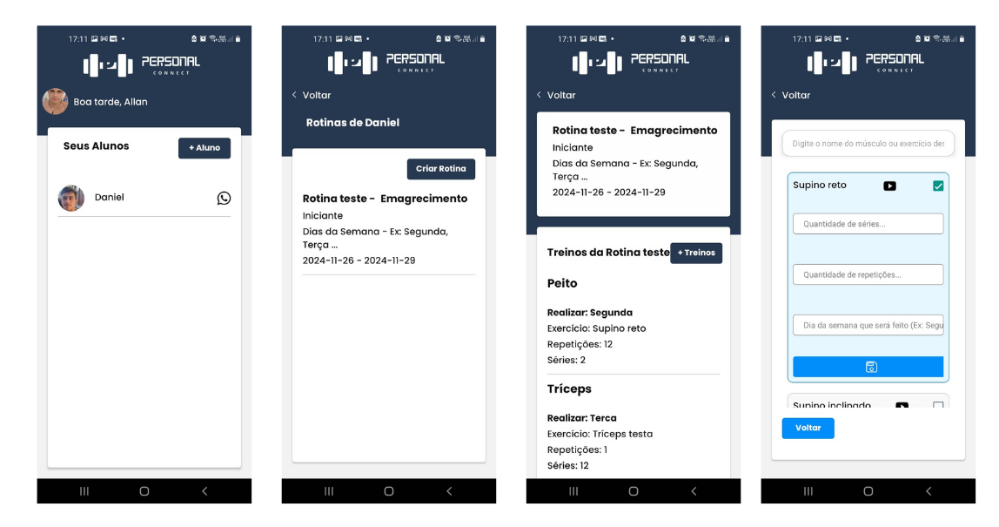

  <h1 align="center">PersonalConnect 🏋🏽🔥💪🏼🎧</h1>

## 💻 Sobre

 
PersonalConnect é um aplicativo desenvolvido como parte do meu Trabalho de Conclusão de Curso (TCC) no curso de <strong>Análise e Desenvolvimento de Sistemas</strong> na <strong>ETEC Hortolândia</strong>. 
O objetivo do projeto é fornecer uma plataforma para personal trainers (treinadores pessoais) gerenciarem e criarem fichas de treinos para seus alunos de forma organizada e eficaz.

## 🎨 Layout

  

___

## 🛠 Tecnologias

As seguintes tecnologias foram empregadas na criação deste projeto:

<ul>
    <li><strong>React Native</strong>: Framework para desenvolvimento de aplicativos móveis nativos.</li>
    <li><strong>TypeScript</strong>: Superset do JavaScript que adiciona tipagem estática ao código.</li>
    <li><strong>Expo</strong>: Ferramenta que facilita o desenvolvimento e a execução de aplicativos React Native.</li>
    <li><strong>Firebase</strong>: Plataforma para autenticação, armazenamento e banco de dados.</li>
    <ul>
        <li><strong>Firebase Auth</strong>: Para autenticação de usuários.</li>
        <li><strong>Firebase Storage</strong>: Para armazenar arquivos como imagens e documentos.</li>
        <li><strong>Firebase Firestore</strong>: Banco de dados NoSQL para armazenar dados de treinos e alunos.</li>
    </ul>
    <li><strong>Restyle</strong>: Biblioteca para criação de UI (interface de usuário) responsiva e com design consistente.</li>
    <li><strong>React Navigation</strong>: Biblioteca para navegação entre telas no React Native.</li>
</ul>

___

## ⚙️ Funcionalidades

<ul>
    <li><strong>Cadastro de Personal Trainer</strong>: Permite que personal trainers se registrem e criem uma conta.</li>
    <li><strong>Cadastro de Alunos</strong>: Os personal trainers podem registrar seus alunos no sistema.</li>
    <li><strong>Criação de Fichas de Treino</strong>: O personal trainer pode criar, editar e gerenciar fichas de treinos para seus alunos de forma organizada.</li>
    <li><strong>Armazenamento de Dados</strong>: Todos os dados, como treinos, alunos e imagens, são armazenados no Firebase Firestore e Firebase Storage.</li>
    <li><strong>Autenticação</strong>: O sistema de autenticação Firebase Auth permite login seguro para personal trainers e seus alunos.</li>
    <li><strong>Interface Responsiva</strong>: A aplicação foi desenvolvida com o Restyle para garantir uma interface de usuário responsiva e agradável em dispositivos móveis.</li>
</ul>

___

## 💬 Contato

Made with ❤️ by <strong>Bruno Henrique de Godoy</strong> 👋🏽

Se você tiver alguma dúvida ou quiser saber mais sobre o projeto, fique à vontade para me contactar através do [LinkedIn](https://www.linkedin.com/in/bruno-godoy-07806726b/).
